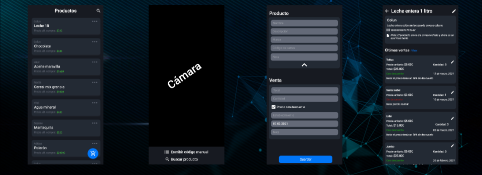

<h1 align="center">Purchases Tracking</h1>

  
Aplicación móvil desarrollada para trackear los precios de compra de diferentes productos

 

## Tech Stack

- Language
  - [Kotlin](https://developer.android.com/kotlin)
  - [XML](https://developer.android.com/guide/topics/ui/declaring-layout?hl=es-419)
- JetPack
  - [LiveData](https://developer.android.com/topic/libraries/architecture/livedata)
  - [Lifecycle](https://developer.android.com/topic/libraries/architecture/lifecycle)
  - [ViewModel](https://developer.android.com/topic/libraries/architecture/viewmodel)
- Dependency Injector
  - [Dagger Hilt](https://dagger.dev/hilt)
- Database
  - [Room](https://developer.android.com/training/data-storage/room)
- UI
  - [Material Components](https://github.com/material-components/material-components-android)
  - [CameraX](https://developer.android.com/training/camerax)
- ML Kit
  - [Barcode Scanning](https://developers.google.com/ml-kit/vision/barcode-scanning)
- Logging
  - [Timber](https://github.com/JakeWharton/timber)
- Testing
  - [Espresso](https://developer.android.com/training/testing/espresso)
  - [Robolectric](http://robolectric.org/)

## TODO
- Improve design :disappointed:
